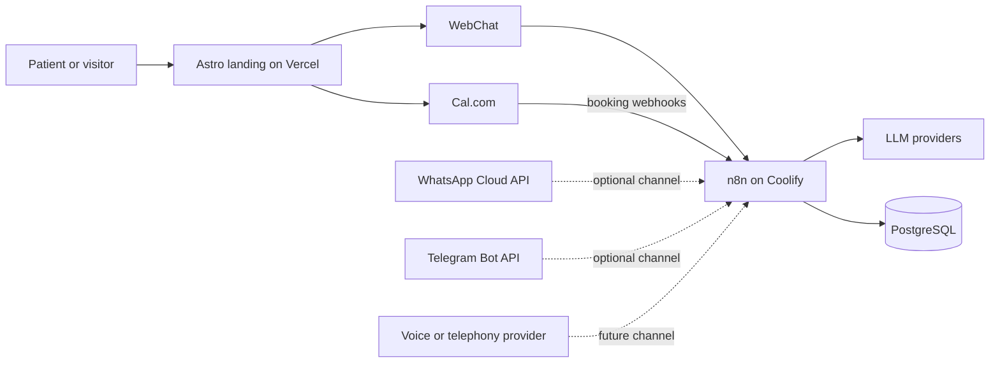

# Dental Clinic Automation

[](https://github.com/luismirand/dental-automatization/actions)
[](https://astro.build/)
[](https://n8n.io/)
[](https://www.postgresql.org/)

A production-deployed reference implementation for automating patient
inquiries, appointment intake, scheduling, and booking synchronization for a
dental clinic.

The project combines a responsive clinic website, an AI-assisted WebChat,
Cal.com scheduling, n8n workflow orchestration, and PostgreSQL persistence.
It is designed as a reusable foundation for agencies or clinics that need a
clear path from a working demonstration to a multi-channel automation service.

## Live Demo

[Open the Smile Studio demo](https://dental-automatization.vercel.app/)

The public deployment uses demonstration clinic content and test data. It is
not a real medical service and must not be used to submit real patient
information.

## Current Status

| Capability | Status | Notes |
|---|---|---|
| Responsive clinic landing | Live | Astro, React, and Tailwind CSS on Vercel |
| AI-assisted WebChat | Live | Connected to the production n8n webhook |
| WebChat conversation history | Live | Persisted in PostgreSQL |
| Cal.com scheduling | Live | Embedded booking flow |
| Booking synchronization | Live | Created, rescheduled, and cancelled events |
| PostgreSQL persistence | Live | Private Docker network; not publicly exposed |
| n8n orchestration | Live | Self-hosted through Coolify |
| WhatsApp Cloud API | Prepared | Workflow and configuration template included; not connected to a live Meta number |
| Telegram bot | Prepared | Workflow and configuration template included; not connected to a live bot |
| Email notifications | Prepared | SMTP variables and workflow extension points are available |
| Automated voice calls | Planned | Can be added through a telephony provider and n8n workflows |

## Patient Journey

```text
Visitor
  |
  +-- Website content and service information
  |
  +-- Sofia WebChat
  |     |
  |     +-- intent classification
  |     +-- clinic knowledge retrieval
  |     +-- LLM provider fallback
  |     +-- conversation persistence
  |     +-- guided appointment intake
  |
  +-- Cal.com booking
        |
        +-- booking created
        +-- booking rescheduled
        +-- booking cancelled
        |
        +-- PostgreSQL appointment record
```

## Architecture



The frontend and automation infrastructure are deployed independently:

- Vercel serves the static landing page.
- Oracle Cloud hosts the ARM64 production VM.
- Coolify manages the n8n and PostgreSQL containers.
- The Coolify proxy provides HTTPS routing to public application endpoints.
- PostgreSQL remains accessible only inside the server and Docker network.

## Implemented Features

### Website

- Responsive dental clinic landing page.
- Service, pricing, location, and contact sections.
- Mobile WebChat adapted to the on-screen keyboard.
- Cal.com scheduling integration.
- Vercel preview and production deployments.

### Conversational automation

- Sofia, an AI-assisted clinic receptionist.
- Deterministic handling for greetings and appointment intake.
- Clinic-specific knowledge mounted as versioned files.
- Provider routing through DeepSeek, Gemini, and OpenRouter.
- Controlled fallback when an AI provider is unavailable.
- Conversation history stored in PostgreSQL.

### Scheduling

- Guided collection of patient name and email before booking.
- Cal.com embedded scheduler.
- Webhook processing for created, rescheduled, and cancelled bookings.
- Normalization of custom Cal.com booking fields.
- Appointment status history in PostgreSQL.

### Operations

- Docker Compose production stack.
- Persistent PostgreSQL and n8n volumes.
- Health checks for both services.
- HTTPS deployment through Coolify.
- Environment-based secret management.
- Production and deployment runbooks.

## Optional Channels

The repository includes workflows and configuration points for additional
channels, but they require separate provider accounts and credentials.

### WhatsApp

The prepared WhatsApp Cloud API integration can receive Meta webhooks, route
messages through n8n, persist the conversation, and send a response. A live
deployment requires a Meta application, a WhatsApp Business account, a phone
number, webhook verification, and production credentials.

### Telegram

The prepared Telegram workflow can connect a bot to the same orchestration and
data layer. A live deployment requires creating a bot, assigning its credential
in n8n, validating the workflow, and activating it.

### Automated voice calls

Voice can be added as an inbound or outbound channel using a telephony or
voice-agent provider. n8n can coordinate call events, appointment reminders,
lead follow-up, human transfer, and PostgreSQL logging. This capability is not
implemented in the current deployment.

## Technology Stack

| Layer | Technology |
|---|---|
| Frontend | Astro 7, React 19, TypeScript, Tailwind CSS 4 |
| Automation | n8n 2 |
| Database | PostgreSQL 16 |
| Scheduling | Cal.com |
| AI providers | DeepSeek, Gemini, OpenRouter |
| Containers | Docker and Docker Compose |
| Frontend hosting | Vercel |
| Backend hosting | Oracle Cloud and Coolify |

## Repository Structure

```text
.
|-- apps/
|   `-- web-landing/             Astro website and React components
|-- infrastructure/
|   |-- docker-compose.yml       Production stack
|   |-- docker-compose.override.yml
|   |-- init-db.sql              Initial PostgreSQL schema
|   |-- migrations/              Incremental database migrations
|   `-- n8n_workflows/           Versioned workflow exports
|-- docs/
|   |-- conocimiento/            Versioned clinic knowledge
|   |-- architecture.md
|   |-- current-state.md
|   |-- database.md
|   |-- calcom-integration.md
|   |-- deploy-vercel.md
|   `-- deploy_coolify.md
|-- scripts/                     Maintenance and workflow utilities
`-- README.md
```

## Local Development

### Requirements

- Node.js 20 or later
- npm
- Docker with Docker Compose
- Git

### Frontend

```powershell
Set-Location apps/web-landing
npm ci
npm run dev
```

The local frontend uses the development WebChat configuration from
`apps/web-landing/.env.example`.

### Infrastructure

```powershell
Set-Location infrastructure
Copy-Item .env.example .env
docker compose up -d
docker compose ps
```

Replace every placeholder in the local `.env` file. Never commit `.env` files,
API keys, passwords, tokens, or exported production credentials.

### Import workflows

Import the required JSON files from `infrastructure/n8n_workflows/` into n8n.
Credential identifiers in an exported workflow may not match a new n8n
instance, so credentials must be created or reassigned before activation.

## Validation

Run the frontend build:

```powershell
Set-Location apps/web-landing
npm ci
npm run build
```

Validate the Compose model:

```powershell
Set-Location ../../infrastructure
docker compose --env-file .env.example config --quiet
```

For an end-to-end release, also verify:

1. The WebChat webhook returns a JSON reply.
2. The conversation is persisted in PostgreSQL.
3. Cal.com can create a test booking.
4. Booking changes are synchronized to PostgreSQL.
5. PostgreSQL port 5432 is not publicly reachable.
6. The landing works at mobile and desktop widths.

## Deployment

- [Frontend deployment on Vercel](docs/deploy-vercel.md)
- [Backend deployment on Oracle Cloud and Coolify](docs/deploy_coolify.md)
- [Cal.com integration](docs/calcom-integration.md)
- [Meta and WhatsApp setup](docs/setup_meta_live.md)
- [Low-cost production plan](docs/production-zero-cost-plan.md)

Production secrets belong in Coolify or the relevant provider's secret store.
Only public browser configuration may use Astro variables prefixed with
`PUBLIC_`.

## Extension Roadmap

- Activate WhatsApp Cloud API.
- Activate the Telegram bot.
- Add automated appointment reminders.
- Add inbound and outbound automated voice calls.
- Add human handoff and reception queues.
- Add email and SMS notifications.
- Add CRM synchronization.
- Add payment links and payment-status workflows.
- Add operational analytics and conversion reporting.
- Add multi-clinic tenancy and per-clinic knowledge.
- Add backup automation and scheduled restore testing.

## Security and Privacy

- Do not use real patient data in development or public demos.
- Do not commit credentials or environment files.
- Keep PostgreSQL private.
- Use synthetic data for tests and screenshots.
- Treat conversational and appointment data as sensitive.
- Review applicable privacy, medical-data, and messaging regulations before
  using this template with real patients.

## Disclaimer

This repository is an automation reference project, not a medical device. The
assistant must not diagnose conditions, prescribe medication, or replace a
qualified dental professional. Pricing and availability displayed by the demo
are illustrative until replaced and reviewed by the operating clinic.

## License

No open-source license has been granted yet. Unless a license file is added,
the repository remains available for viewing but retains the author's default
copyright protections.
