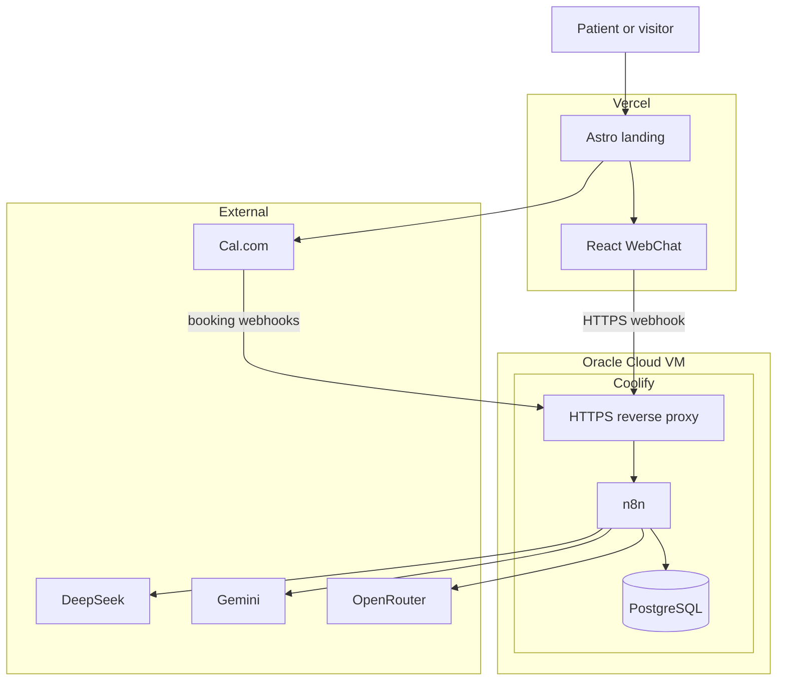
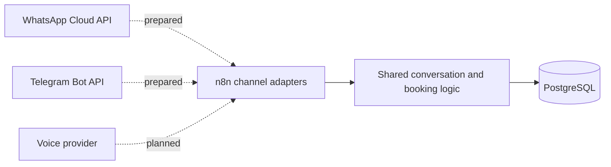

# System Architecture

## Purpose

This system automates patient acquisition, clinic inquiries, appointment
intake, scheduling, and booking synchronization for a dental clinic. It is a
reference architecture intended to be customized before handling real
patients.

## Production Architecture

## Components

### Frontend

Location: `apps/web-landing`

- Astro static application deployed on Vercel.
- React islands for interactive components.
- Tailwind CSS for responsive presentation.
- WebChat for clinic inquiries and booking intake.
- Cal.com embed for schedule selection.

The frontend contains only public configuration. It must never receive provider
API keys or database credentials.

### Automation

Location: `infrastructure/n8n_workflows`

- Receives WebChat and Cal.com webhooks.
- Classifies conversational intent.
- Builds clinic-specific LLM context.
- Routes requests through configured LLM providers.
- Persists conversations and booking events.
- Normalizes provider-specific payloads into the internal data model.

### Persistence

Location: `infrastructure/init-db.sql` and `infrastructure/migrations`

PostgreSQL stores:

- leads and channel identifiers;
- active conversations;
- chat messages;
- appointments and booking state;
- normalized appointment metadata.

PostgreSQL binds to the server loopback interface and the private Docker
network. Port 5432 must not be exposed publicly.

### Scheduling

Cal.com is the source of truth for availability and booking selection. n8n
receives booking lifecycle webhooks and synchronizes the normalized status to
PostgreSQL.

### Deployment

- GitHub is the source repository.
- Pull requests create Vercel preview deployments.
- `main` creates the Vercel production deployment.
- Coolify deploys the production Docker Compose application from `main`.
- Coolify manages HTTPS routing, service health, environment variables, and
  persistent volumes.

## Optional Channel Architecture

WhatsApp and Telegram workflow definitions are present but not activated in the
live deployment. Automated voice calls are a planned extension and require a
telephony or voice-agent provider.

## Trust Boundaries

- The browser is untrusted and may access only public webhook endpoints.
- Coolify stores runtime secrets outside Git.
- n8n mediates access to LLM, scheduling, and messaging providers.
- PostgreSQL is private and accepts connections only from authorized local
  services.
- External webhook signatures should be verified whenever the provider offers
  signing secrets.

## Failure and Scaling Characteristics

- LLM provider failures are handled through provider fallback and a controlled
  response.
- PostgreSQL and n8n use persistent storage but currently share one VM.
- The current host is suitable for a small production workload and
  demonstrations, not high availability.
- Additional client projects should be isolated as separate Coolify projects
  and moved to additional servers when CPU, memory, or storage thresholds are
  reached.
